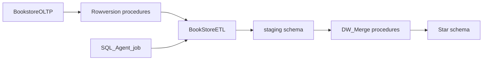
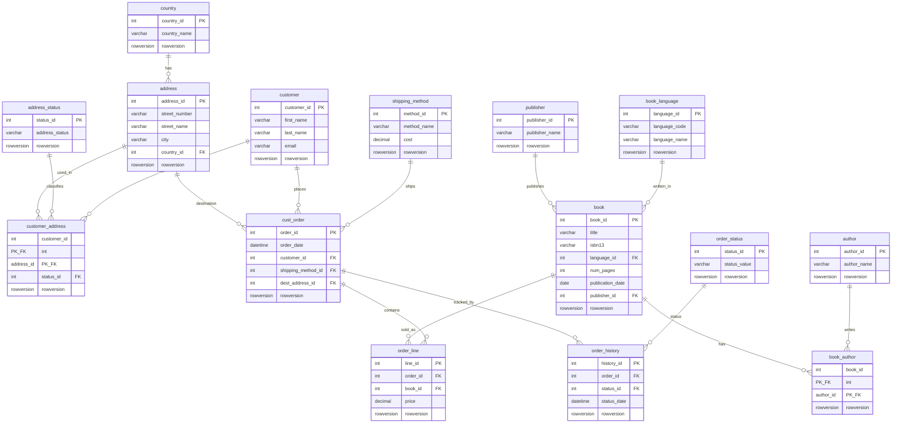
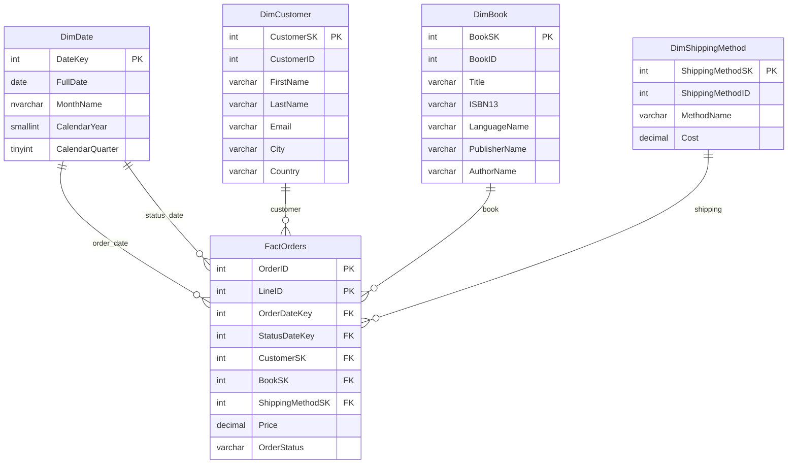

# MIA-V1E6

## Módulo: Data Management and Business Intelligence

### Descripción

Solución de Business Intelligence para una librería (Bookstore). Incluye una base transaccional (OLTP), un data warehouse en esquema estrella y un proceso ETL incremental con SSIS, controlado por `ROWVERSION` y un job de SQL Agent.

### Grupo

5

### Integrantes

- Ligia Gabriela Barrera Copa
- Victor Hugo Gutierrez
- Loren Dereck Jiménez
- Limber Maldonado Casillo
- Kevin Alexis Padilla Lopez

### Proyectos

| Proyecto | Tipo | Rol |
| --- | --- | --- |
| [BookstoreOLTP](Bookstore/BookstoreOLTP.sqlproj) | SSDT | Base transaccional: 15 tablas, procedimientos CDC por `ROWVERSION` y datos semilla |
| [BookstoreDW](BookstoreDW/BookstoreDW.sqlproj) | SSDT | Data warehouse: dimensiones, `FactOrders`, esquema `staging` y `PackageConfig` |
| [BookStoreETL](BookStoreETL/BookStoreETL.dtproj) | SSIS | Paquetes que extraen cambios del OLTP, cargan staging y fusionan al DW |

El job de SQL Agent está en [Jobs/BookStoreETLJob.sql](Jobs/BookStoreETLJob.sql).

## Arquitectura



Carga incremental:

1. El OLTP expone cambios con `GetDatabaseRowVersion` y `Get*ChangesByRowVersion`.
2. El DW guarda el último `ROWVERSION` procesado en `dbo.PackageConfig` (`GetLastPackageRowVersion` / `UpdateLastPackageRowVersion`).
3. SSIS copia los cambios a `staging` y llama a los procedimientos `DW_Merge*`.

Orden del job: **DimShippingMethod** → **DimCustomer** → **DimBook** → **FactOrders**.

## Estructura del repositorio

```
BookStore.slnx
Bookstore/                          SSDT OLTP (BookstoreOLTP)
  src/schema/tables/                15 tablas
  src/schema/procedures/            6 procedimientos CDC
  src/scripts/                      datos semilla y post-deploy
  docs/                             runbook de publicación y baseline
  Properties/                       plantilla de perfil de publish
BookstoreDW/                        SSDT data warehouse
  src/schema/tables/dbo/            dimensiones, hecho, PackageConfig
  src/schema/tables/staging/        tablas de staging
  src/schema/programmability/       procedimientos de merge y CDC
  src/scripts/                      DimDate, PackageConfig, post-deploy
BookStoreETL/                       SSIS (4 paquetes)
Jobs/                               script del job de SQL Agent
```

La solución Visual Studio agrupa los proyectos en `Databases/OLTP`, `Databases/DataWarehouse` y `ETL`.

## Diagrama OLTP

15 tablas. Todas incluyen `rowversion` para CDC. Relaciones según las claves foráneas del proyecto SSDT.



Procedimientos CDC del OLTP:

- `dbo.GetDatabaseRowVersion`
- `dbo.GetAddressChangesByRowVersion`
- `dbo.GetBookChangesByRowVersion`
- `dbo.GetCustomerChangesByRowVersion`
- `dbo.GetShippingMethodChangesByRowVersion`
- `dbo.GetOrdersChangesByRowVersion`

## Diagrama del data warehouse

Esquema estrella. Grano de `FactOrders`: `(OrderID, LineID)`.



Objetos de apoyo:

- `staging.book`, `staging.customer`, `staging.shipping_method`, `staging.orders`
- `dbo.PackageConfig` (`TableName`, `LastRowVersion`)
- `DW_MergeDimBook`, `DW_MergeDimCustomer`, `DW_MergeDimShippingMethod`, `DW_MergeFactOrders`

`DimDate` se carga en el post-deploy del DW (no por SSIS).

## Cómo abrir y desplegar

### Requisitos

- Visual Studio 2022 o posterior, con SQL Server Data Tools (SSDT) e Integration Services (SSIS)
- SQL Server local (o accesible) con autenticación de Windows
- `SqlPackage` y `sqlcmd` para publicar DACPAC

### Abrir la solución

Abrir `BookStore.slnx` en Visual Studio. No hay restauración de paquetes NuGet: los proyectos son SSDT y SSIS.

### Orden de despliegue

1. Publicar **BookstoreOLTP** (esquema y datos semilla).
2. Publicar **BookstoreDW** (dimensiones, hecho, staging, `DimDate` y `PackageConfig`).
3. Desplegar el proyecto SSIS al catálogo SSISDB, carpeta `BookStore`.
4. Crear o actualizar el job de SQL Agent con [Jobs/BookStoreETLJob.sql](Jobs/BookStoreETLJob.sql). El script fija el propietario `LAPTOP-LTNQC5A3\Ligia`; cámbielo antes de ejecutarlo.

El runbook de publicación del OLTP (perfil local, `SqlPackage`, revisión del script) está en [Bookstore/docs/deployment.md](Bookstore/docs/deployment.md). La comparación de esquema de referencia está en [Bookstore/docs/baseline-schema-comparison.md](Bookstore/docs/baseline-schema-comparison.md).

Paquetes SSIS:

- `DimShippingMethod.dtsx`
- `DimCustomer.dtsx`
- `DimBook.dtsx`
- `FactOrders.dtsx`
