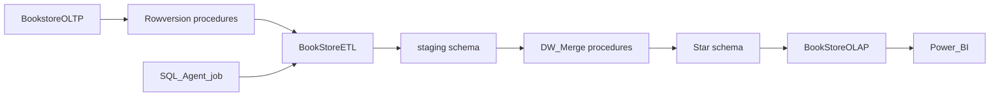
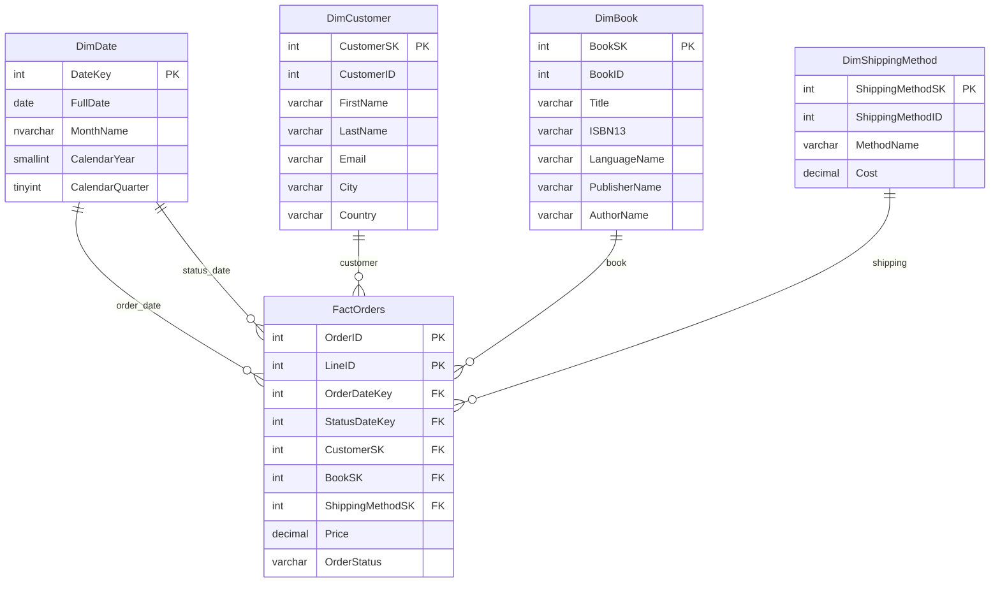
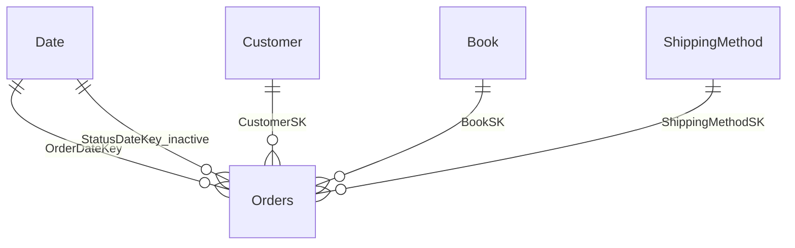

# MIA-V1E6

## Módulo: Data Management and Business Intelligence

### Descripción

Solución de Business Intelligence para una librería (Bookstore). Incluye una base transaccional (OLTP), un data warehouse en esquema estrella, un proceso ETL incremental con SSIS (controlado por `ROWVERSION` y un job de SQL Agent) y un modelo tabular de Analysis Services para análisis y reportes.

### Grupo

5

### Integrantes

- Ligia Gabriela Barrera Copa
- Victor Hugo Gutierrez
- Loren Dereck Jiménez
- Limber Maldonado Casillo
- Kevin Alexis Padilla Lopez

### Proyectos

| Proyecto | Tipo | Rol |
| --- | --- | --- |
| [BookstoreOLTP](Bookstore/BookstoreOLTP.sqlproj) | SSDT | Base transaccional: 15 tablas, procedimientos CDC por `ROWVERSION` y datos semilla |
| [BookstoreDW](BookstoreDW/BookstoreDW.sqlproj) | SSDT | Data warehouse: dimensiones, `FactOrders`, esquema `staging` y `PackageConfig` |
| [BookStoreETL](BookStoreETL/BookStoreETL.dtproj) | SSIS | Paquetes que extraen cambios del OLTP, cargan staging y fusionan al DW |
| [BookStoreOLAP](BookStoreOLAP/BookStoreOLAP.smproj) | SSAS tabular | Modelo semántico sobre `BookstoreDW` (In-Memory), desplegable en Analysis Services |

El job de SQL Agent está en [Jobs/BookStoreETLJob.sql](Jobs/BookStoreETLJob.sql).

## Arquitectura



Carga incremental:

1. El OLTP expone cambios con `GetDatabaseRowVersion` y `Get*ChangesByRowVersion`.
2. El DW guarda el último `ROWVERSION` procesado en `dbo.PackageConfig` (`GetLastPackageRowVersion` / `UpdateLastPackageRowVersion`).
3. SSIS copia los cambios a `staging` y llama a los procedimientos `DW_Merge*`.

Orden del job: **DimShippingMethod** → **DimCustomer** → **DimBook** → **FactOrders**.

## Estructura del repositorio

```
BookStore.slnx
Bookstore/                          SSDT OLTP (BookstoreOLTP)
  src/schema/tables/                15 tablas
  src/schema/procedures/            6 procedimientos CDC
  src/scripts/                      datos semilla y post-deploy
  docs/                             runbook de publicación y baseline
  Properties/                       plantilla de perfil de publish
BookstoreDW/                        SSDT data warehouse
  src/schema/tables/dbo/            dimensiones, hecho, PackageConfig
  src/schema/tables/staging/        tablas de staging
  src/schema/programmability/       procedimientos de merge y CDC
  src/scripts/                      DimDate, PackageConfig, post-deploy
BookStoreETL/                       SSIS (4 paquetes)
BookStoreOLAP/                      SSAS tabular (modelo In-Memory)
  BookStoreOLAP.bim                 definición del modelo (tablas, relaciones, DAX)
  reports/                          informe Power BI de ejemplo
Jobs/                               script del job de SQL Agent
```

La solución Visual Studio agrupa los proyectos en `Databases/OLTP`, `Databases/DataWarehouse`, `ETL` y `OLAP`.

## Diagrama OLTP

15 tablas. Todas incluyen `rowversion` para CDC. Relaciones según las claves foráneas del proyecto SSDT.


Procedimientos CDC del OLTP:

- `dbo.GetDatabaseRowVersion`
- `dbo.GetAddressChangesByRowVersion`
- `dbo.GetBookChangesByRowVersion`
- `dbo.GetCustomerChangesByRowVersion`
- `dbo.GetShippingMethodChangesByRowVersion`
- `dbo.GetOrdersChangesByRowVersion`

## Diagrama del data warehouse

Esquema estrella. Grano de `FactOrders`: `(OrderID, LineID)`.



Objetos de apoyo:

- `staging.book`, `staging.customer`, `staging.shipping_method`, `staging.orders`
- `dbo.PackageConfig` (`TableName`, `LastRowVersion`)
- `DW_MergeDimBook`, `DW_MergeDimCustomer`, `DW_MergeDimShippingMethod`, `DW_MergeFactOrders`

`DimDate` se carga en el post-deploy del DW (no por SSIS).

## Modelo tabular (OLAP)

Proyecto de Analysis Services en modo **tabular In-Memory** (`DirectQueryMode = InMemory`). Nivel de compatibilidad **1200**. El origen de datos es la base `BookstoreDW`. Al desplegar, la base en el servidor SSAS se llama `BookStoreOLAP` y el cubo/modelo `Model`.

Tablas del modelo (nombres de presentación → tabla del DW). Las claves técnicas (`*SK`, `*ID`, `*Key`) y columnas usadas solo en cálculos están ocultas para el cliente.

| Tabla del modelo | Fuente DW | Visible en el cliente |
| --- | --- | --- |
| Book | `dbo.DimBook` | Title, LanguageName, NumPages, PublicationDate, PublisherName, AuthorName |
| Customer | `dbo.DimCustomer` | `CustomerName` (columna calculada: `FirstName` + `LastName`) |
| Date | `dbo.DimDate` | MonthName, CalendarYear |
| ShippingMethod | `dbo.DimShippingMethod` | MethodName, Cost |
| Orders | `dbo.FactOrders` | OrderStatus, OrderDate, StatusDate y las medidas |

Grano de `Orders`: una fila por línea de pedido (`OrderID`, `LineID`). `Price` es el importe de la línea, no el cobro efectivo. `OrderStatus` es el último estado cargado desde el OLTP (`Order Received`, `Pending Delivery`, `Delivery In Progress`, `Delivered`, `Cancelled`, `Returned`). El importe de pedidos cancelados o devueltos sigue en `Price`; no debe mezclarse con las ventas reconocidas.

Medidas DAX en `Orders` (definidas en el `.bim`):

| Medida | Uso |
| --- | --- |
| `Revenue` | Suma de `Price` (importe bruto pedido, todos los estados) |
| `Net Revenue` | `Price` solo de líneas `Delivered` |
| `Cancelled Amount` / `Returned Amount` | Importe de líneas `Cancelled` o `Returned` |
| `Cancel Rate` | `[Cancelled Amount] / [Revenue]` |
| `Order Count` | Pedidos distintos (`OrderID`) |
| `Line Items` | Número de líneas |
| `Avg Lines Per Order` | Líneas por pedido |
| `Delivered Orders`, `Pending Delivery Orders`, `In Progress Delivery Orders`, `Canceled Delivery Orders` | Pedidos distintos filtrados por estado |

El estado en OLTP se escribe **Cancelled** (dos eles). Las medidas de importe usan esa cadena; el nombre `Canceled Delivery Orders` es solo la etiqueta.

No consultar `staging` ni `PackageConfig` desde el modelo: el tabular solo incluye el esquema estrella (`dbo`).

Consultas DAX en SSMS (conexión a **Analysis Services**, base `BookStoreOLAP`; ventana *Analysis Services DAX Query*, no MDX). `FROM [Model]` es el nombre del cubo tabular, no una tabla del DW.

```dax
EVALUATE
SUMMARIZECOLUMNS (
    Orders[OrderStatus],
    "Orders", [Order Count],
    "Gross", [Revenue],
    "Net", [Net Revenue],
    "Cancelled", [Cancelled Amount]
)
```

```dax
EVALUATE
SUMMARIZECOLUMNS (
    'Date'[CalendarYear],
    Book[PublisherName],
    "Net Revenue", [Net Revenue],
    "Orders", [Order Count]
)
```

Para explorar el modelo desde Visual Studio: desplegar/procesar y **Analyze in Excel**, o abrir [BookStoreOLAP/reports/report.pbix](BookStoreOLAP/reports/report.pbix).

Relaciones (esquema estrella). `Date` es una dimensión con dos roles: la relación activa usa la fecha de pedido; la de estado queda inactiva.



- Activas: `Orders[OrderDateKey] → Date[DateKey]`, `Orders[CustomerSK] → Customer[CustomerSK]`, `Orders[BookSK] → Book[BookSK]`, `Orders[ShippingMethodSK] → ShippingMethod[ShippingMethodSK]`
- Inactiva: `Orders[StatusDateKey] → Date[DateKey]` (usar `USERELATIONSHIP` en DAX si se analiza por fecha de estado)

Hay un reporte de ejemplo en [BookStoreOLAP/reports/report.pbix](BookStoreOLAP/
reports/report.pbix).

## Cómo abrir y desplegar

### Requisitos

- Visual Studio 2022 o posterior, con SQL Server Data Tools (SSDT), Integration Services (SSIS) y Analysis Services (proyecto tabular)
- SQL Server local (o accesible) con autenticación de Windows
- Instancia de SQL Server Analysis Services en modo tabular (por defecto el proyecto despliega a `localhost`)
- `SqlPackage` y `sqlcmd` para publicar DACPAC
- Power BI Desktop (opcional) para abrir el informe en `BookStoreOLAP/reports`

### Abrir la solución

Abrir `BookStore.slnx` en Visual Studio. No hay restauración de paquetes NuGet: los proyectos son SSDT, SSIS y SSAS tabular.

### Orden de despliegue

1. Publicar **BookstoreOLTP** (esquema y datos semilla).
2. Publicar **BookstoreDW** (dimensiones, hecho, staging, `DimDate` y `PackageConfig`).
3. Desplegar el proyecto SSIS al catálogo SSISDB, carpeta `BookStore`.
4. Crear o actualizar el job de SQL Agent con [Jobs/BookStoreETLJob.sql](Jobs/BookStoreETLJob.sql). El script fija el propietario `LAPTOP-LTNQC5A3\Ligia`; cámbielo antes de ejecutarlo.
5. Desplegar **BookStoreOLAP** a Analysis Services (`localhost` → base `BookStoreOLAP`). Ajuste la cadena de conexión del origen `SqlServer … BookstoreDW` si el servidor o la base del DW no coinciden con su entorno, y procese el modelo para cargar los datos.

El runbook de publicación del OLTP (perfil local, `SqlPackage`, revisión del script) está en [Bookstore/docs/deployment.md](Bookstore/docs/deployment.md). La comparación de esquema de referencia está en [Bookstore/docs/baseline-schema-comparison.md](Bookstore/docs/baseline-schema-comparison.md).

Paquetes SSIS:

- `DimShippingMethod.dtsx`
- `DimCustomer.dtsx`
- `DimBook.dtsx`
- `FactOrders.dtsx`
